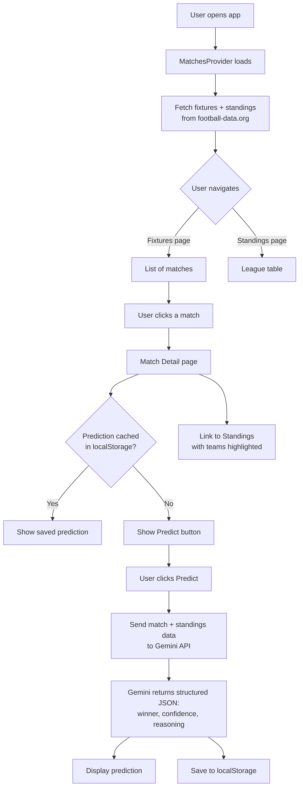
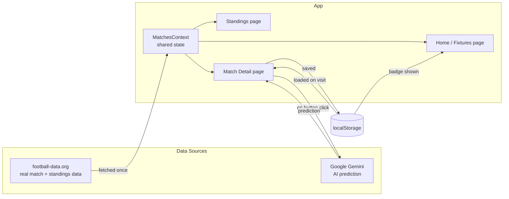

# FIFA Prediction Engine — Project Documentation

A React app that shows live Premier League fixtures and standings, and uses an AI model (Google Gemini) to predict match outcomes based on real team data.

---

## 1. What This Project Actually Does

1. Shows a list of upcoming Premier League matches (real data, not mock data)
2. Shows the live league table (team positions, points, games played)
3. Lets you click "Predict Outcome" on any match — an AI model looks at both teams' standings and returns a predicted winner, a confidence %, and a one-line reason
4. Saves that prediction so it's still there if you refresh the page
5. Lets you jump from a match straight to the standings table with both teams highlighted

---

## 2. The Overall Flow



**In plain terms:** the app loads real data once, holds it in a shared "pool" (Context) that every page can read from, and only calls the AI when you explicitly ask for a prediction — it never calls the AI automatically or repeatedly for the same match unless you ask again.

---

## 3. Architecture — How the Pieces Fit Together



---

## 4. Why Each Piece Was Chosen

| Piece | What it does | Why this one |
|---|---|---|
| **Vite** | Build tool / dev server | Much faster than Create React App, the current standard for new React projects |
| **React Router** | Multi-page navigation | Lets the app feel like separate pages (Fixtures, Standings, Match Detail) without full page reloads |
| **React Context** | Shared state across pages | Fixtures and standings are fetched once and reused everywhere, instead of every page fetching its own copy |
| **football-data.org** | Real match/league data | Free tier, no card required, covers major leagues including Premier League — good enough for a learning project without hidden costs |
| **Google Gemini (Flash)** | AI prediction | Free tier is generous for a project like this, and it's fast enough to feel responsive when clicking "Predict" |
| **localStorage** | Saving predictions | Lets predictions survive a page refresh without needing a real backend/database — the simplest form of persistence for a frontend-only app |
| **Vite dev proxy** | Bypassing CORS | football-data.org blocks direct browser calls for security; the proxy routes requests through Vite's dev server so the browser doesn't block them locally |

---

## 5. Key React Concepts Used (in Plain English)

- **Components** — Each page (`Home`, `Standings`, `MatchDetail`) is just a function that returns what should appear on screen. Small, reusable pieces instead of one giant file.
- **Props** — Data passed from a parent component down to a child. One-directional: parent → child only.
- **State (`useState`)** — A value React "watches." When it changes, the screen updates automatically — no manual redrawing.
- **Effects (`useEffect`)** — Code that runs automatically when a component loads (e.g. "fetch data once when this page opens").
- **Context (`useContext`)** — A shared box of data that any component can read from directly, without passing it down through every layer manually.
- **Routing (`react-router-dom`)** — Maps a URL (like `/match/12345`) to a specific page component, and lets links update the URL without a full page reload.
- **Route Parameters (`:matchId`)** — A placeholder in the URL that tells the app which specific match to show.
- **Query Parameters (`?home=...&away=...`)** — Extra info attached to a URL, used here to tell the Standings page which two teams to highlight.

---

## 6. Why an AI Prediction (Not Just Rule-Based Logic)

A simple rule ("team with more points wins") would work, but it wouldn't demonstrate real AI engineering skill. Instead, this project:

1. Pulls **real data** (each team's position, points, games played)
2. Builds a **structured prompt** asking the AI to reason using that data
3. Forces the AI to respond in a **strict JSON format** (`{"winner": ..., "confidence": ..., "reasoning": ...}`) instead of free-form text — this is what makes the AI's output usable by actual code, not just readable by a human
4. Handles the real-world messiness of AI responses (stripping markdown formatting Gemini sometimes adds, handling rate limits, handling missing data)

This is the difference between "I called an AI API" and "I designed a small AI-powered decision system" — the second is a stronger, more accurate way to describe this project.

---

## 7. Known Limitations (Worth Being Upfront About)

- **Data is delayed, not live-live** — football-data.org's free tier doesn't offer real-time in-game scores, only delayed fixtures/standings. Fine for predictions made ahead of a match, not for live commentary.
- **CORS proxy only works locally** — the Vite dev proxy that bypasses CORS won't work once deployed (Week 4 territory); a small serverless function would be needed for a live deployed version.
- **Predictions aren't "real" ML** — this is prompt-based reasoning over real data, not a trained statistical model. It's honestly described as AI-assisted reasoning, not machine learning in the strict sense.

---

## 8. Folder Structure

```
fifa-prediction-engine/
├── src/
│   ├── api/
│   │   ├── football.js        # fetches fixtures & standings from football-data.org
│   │   ├── predict.js         # sends match data to Gemini, parses structured response
│   │   └── predictionStorage.js  # localStorage read/write helpers
│   ├── context/
│   │   └── MatchesContext.jsx # shared state: fixtures + standings, fetched once
│   ├── pages/
│   │   ├── Home.jsx           # fixtures list + "predicted" badges
│   │   ├── Standings.jsx      # league table + highlight-on-query-param
│   │   └── MatchDetail.jsx    # single match view + AI prediction button
│   ├── App.jsx                # routing + Context provider setup
│   └── main.jsx
├── vite.config.js             # dev proxy config (CORS workaround)
└── .env                       # API keys (not committed to git)
```
